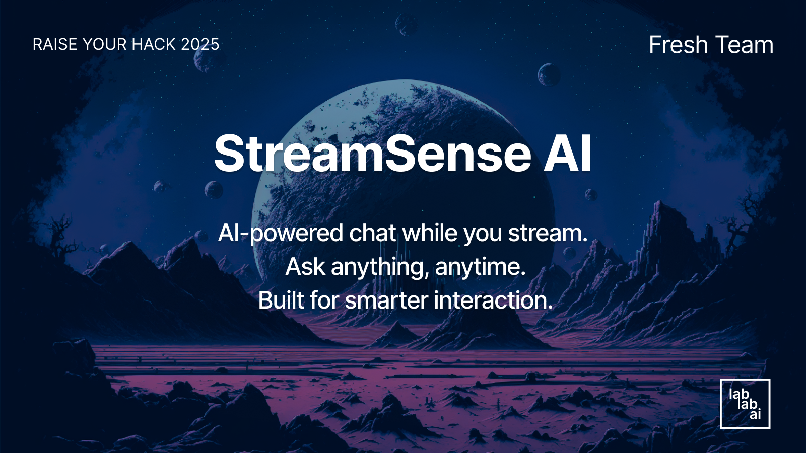

# StreamSense AI
Smart AI-powered chatbot for webinars and livestreams

AI-powered chat while you stream.  
Ask anything, anytime.  
Built for smarter interaction.

**Ask questions. Watch videos. Get instant answers.**  
An AI-powered assistant that listens and responds during live or recorded streams.

---

## 🧠 What is it?

**StreamSense AI** is a web-based application that lets users ask questions during a livestream or webinar.  
It uses speech-to-text, RAG (retrieval-augmented generation), and a generative AI model to provide real-time answers via chat.

> Imagine a webinar where you don’t have to wait for Q&A — you ask, the AI replies. Instantly.

---

## 🎙️ Elevator pitch (original concept)

*This was the original pitch provided by the product idea team during the hackathon.*

Have you ever wanted to ask a question during a sales webinar—but held back out of embarrassment, fear of interrupting, or discomfort sharing details about your business in public? Worse, have you wasted 15 minutes listening to a Q&A that had nothing to do with your needs? We have too—and so have your customers.

**Meet StreamSense AI**  
StreamSense AI turns every passive viewer into an engaged participant by creating a personalized, private sales experience—right inside your webinar. As the presentation plays, viewers can ask questions discreetly at any time. StreamSense AI listens to the livestream in real time and instantly responds with tailored, context-aware answers, powered by AI and your product content. StreamSense AI even knows how to ask the right questions to learn about your prospect and move them down the funnel.

The result? More trust, deeper engagement, and significantly higher conversions—without adding any manual overhead.  
Getting started is as easy as adding one tag to your webinar page—generate it in seconds from your dashboard, and you're live.

---

## 🚀 Features

- 🎥 Seamless integration with live video
- 💬 Smart AI chat assistant (LLaMA + custom prompts)
- 🧾 Real-time transcription (via Groq or Whisper)
- 🔍 Enriched with product or website content (RAG)
- 💡 Helpful, responsive, and contextual answers

---

## 🛠️ How it works

1. The user watches a livestream (tagged page)
2. The AI listens via audio transcription
3. It retrieves relevant content (site or product)
4. The chatbot answers questions in real time

---

## 🧪 Tech Stack

### 🖥️ Frontend
- **Figma UI** (UX prototyping & visual design)
- **React.js** with **Styled Components**
- **Responsive chat interface** with real-time feedback
- Deployment: **GitHub Pages** or **Vultr**

### 🤖 AI & Backend
- **LLM**: Groq API using **LLaMA2-70B**
- **Audio transcription**: Groq Whisper
- **RAG pipeline**: Custom implementation with document processing
- **FastAPI**: for API endpoints and orchestration
- **Periodic context updates**: synced with video timeline

### 🧱 Project Structure
src/ → Source code
audio/ → Audio processing modules
document_processor/ → Text & context extraction
rag/ → RAG pipeline logic
api/ → FastAPI endpoints
tests/ → Unit testing
config/ → Configuration files
docs/ → Project documentation

### ⚙️ Logic & Architecture
- **State management**: React Hooks
- **Prompt engineering**: contextual prompts for relevance
- **Context sync**: automatic refresh based on video position

---

## 🎨 UX/UI Design 

As the UX/UI designer on this project, my mission was to turn a technical AI prototype into a **clear, engaging, and intuitive user experience**.

### ✨ My contributions

- **UX flows & wireframes** to define:
  - watching a video
  - chatting with the AI in real time
  - receiving contextual answers
- **UI system designed in Figma**, including:
  - clean, responsive layout
  - accessible, modular components
  - dreamlike yet tech-inspired visual identity (soft gradients, light glassmorphism)
- **Chatbot visual identity**:
  - creation of a friendly robot persona
  - icon prompt generation & refinement
  - interaction states: user input, AI typing, answer
- **Handoff** of all design assets to the dev team (Figma → React components)

> This project was built in less than 48 hours as part of the **RAISE Summit Hackathon**.  
> I’m proud to have shaped an AI-powered experience that feels both intelligent and human.

---

## 📸 Preview

## 🤝 Team

This project was built during the **RAISE Summit Hackathon**  
by the **Fresh Team**

---

## 📌 License

MIT – Free to use, remix, and build on.
